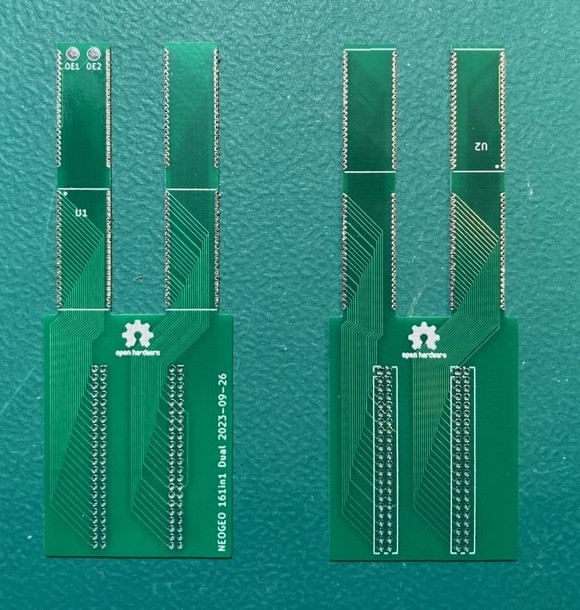
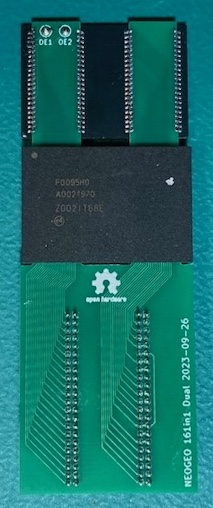
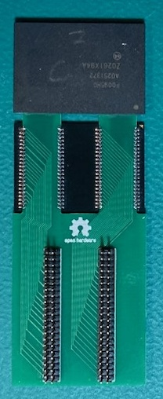
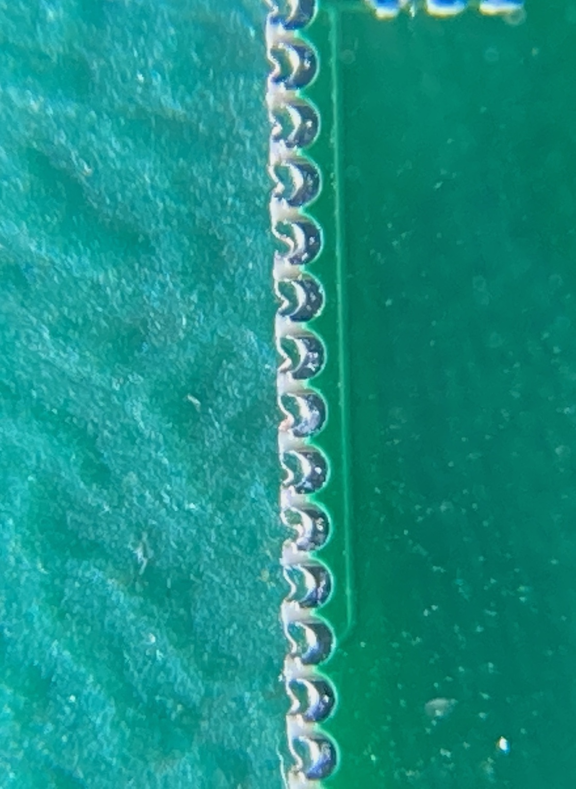
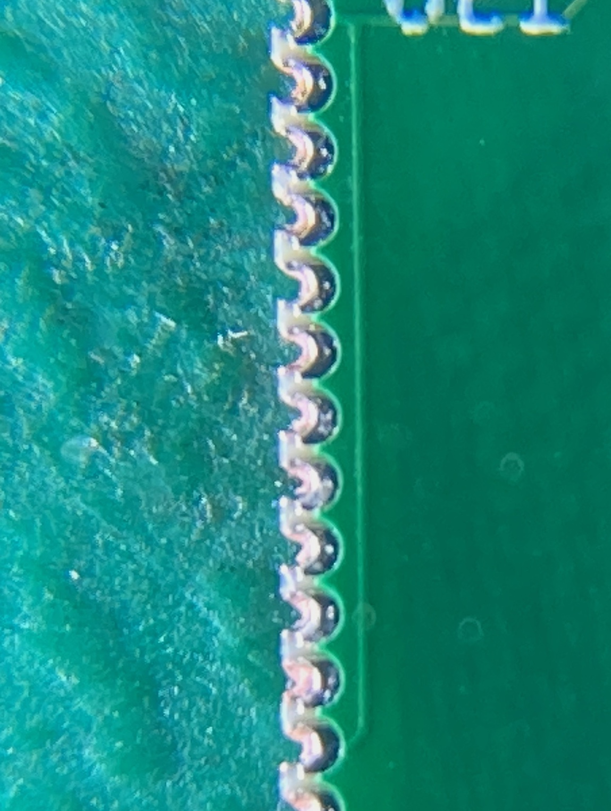
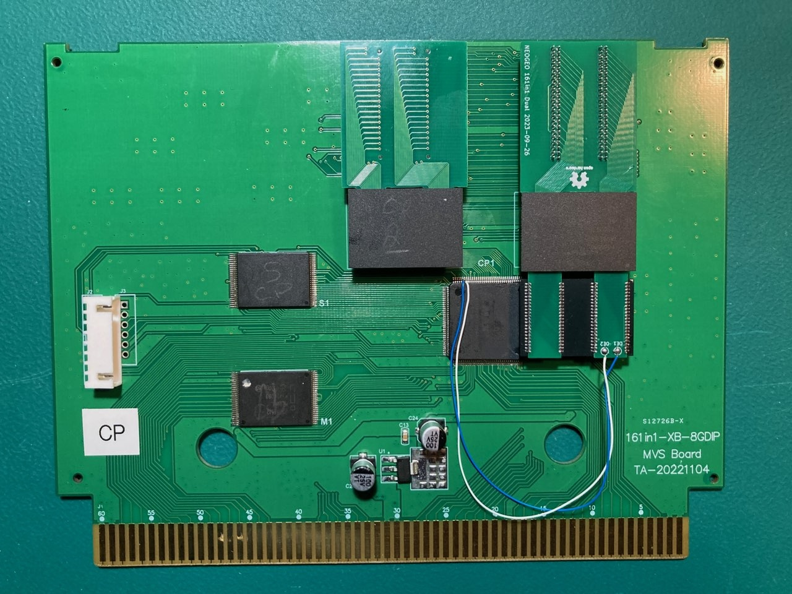
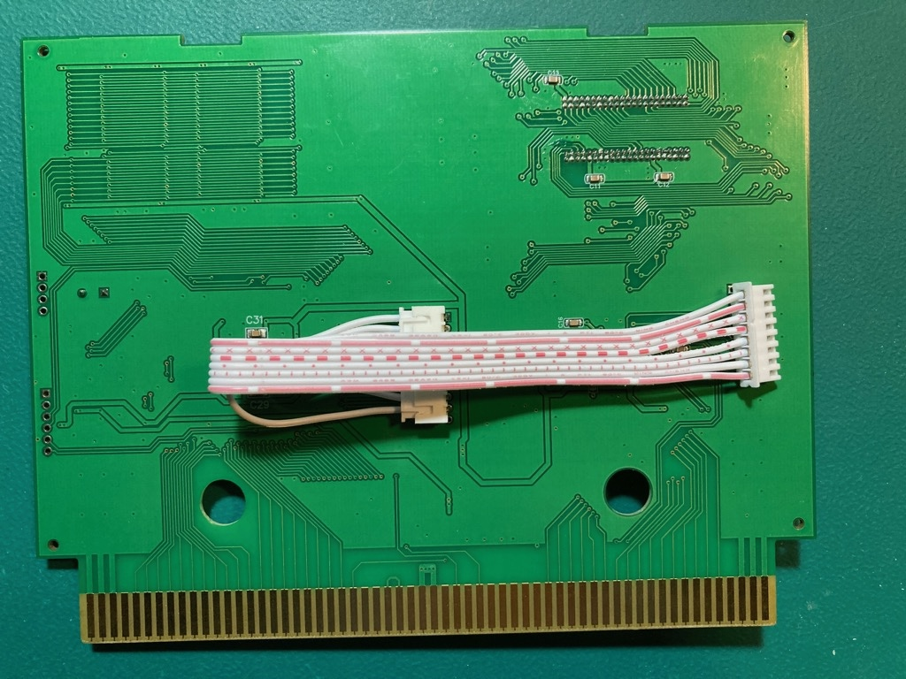
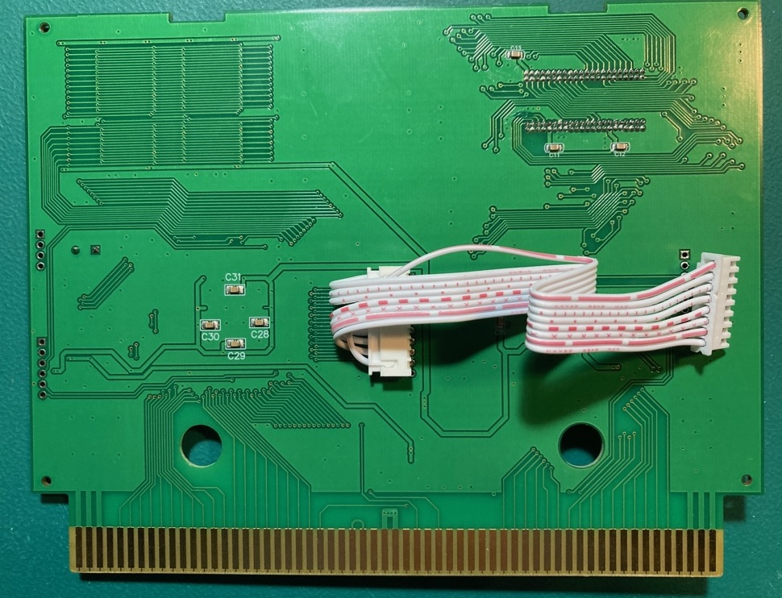

# neogeo-161in1-dual-daughterboard

## Overview
Vortex's [VTXCart](https://github.com/xvortex/VTXCart/tree/main) project allows rewriting flash/cpld chips on the 161in1 V3 cart to contain whatever neogeo games you want.  However there isn't enough C flash space on a stock 161in1 cart to handle the entire neogeo library.  

The C (and V) flash chips come on small daughterboards.  One flash chip per daughterboard.  This dual daughterboard project is a replacement daughterboard that adds support for 2 flash chips on the daughterboard.  This increases the available C flash space to go from 2G to 3G, which make possible to have the entire neogeo library on the cart.

**NOTE:** This has only been tested on the MVS version of the 161in1 V3 cart.  I have not seen the inside of the AES version to know if the dual daughterboard can even fit.

**Bare Boards:** 

**Assembled Top/Bottom:** 

## Manufacturing
The board has very fine pitched (0.8mm) castellated holes on it.  Ideally you would want to pick the castellated holes option with the PCB manufacture so they get cut cleanly.  However the PCB manufacturer will likely reject the order if you pick this option because most require 0.6mm hole diameter and 0.6mm distance between castellated holes.

Placing the order without the castellated holes option should be allowed but will leave the holes slightly mangled, like this.

You can see how the copper from the left side of the through hole is still there just kinda push flat against the cut path.  To fix this you can use a fine tipped tweezers and push that extra copped into the right side of the hole, resulting in this

Don't attempt to pull the extra copper off or you could rip out the rest of the copper in the through hole.

## Programming
One thing you need to consider is how you are going to program the flash chips.  

With only U1 flash chip installed the dual daughterboard will act the same as a normal daughterboard for reading/writing.  So you can use Vortex's F0095H0 dumper board to program it.

However the flash chip that will installed into U2 will need to be flashed by something else.  Ideally you should use the original daughterboard it came on with the F0095H0 dumper board.

## What to flash
Running vortex's compiler program with the 'c3g' option will increase the available C rom space 3G.  When completed it should have generated 3 crom files.  They need to be flashed as follows.

crom-1 = U1 on dual daughterboard 
crom-2 = normal daughterboard (installed in the left most C rom daughterboard location, as seen below) 
crom-3 = U2 on dual daughterboard 

## Install
Installed will looks like this

The dual daughterboard must be installed into the right most C rom daughterboard location.  Its not possible in the left because it will collide with the white board to board connector on the back of the PROG board.

The OE1 and OE2 pins on the dual daughterboard need to be soldered to pins on the CLPD.  As of right now the allocated pins are

AES:
  * OE1 = PIN 48
  * OE2 = PIN 47

MVS
  * OE1 = PIN 31
  * OE2 = PIN 30

You should however verify this is still the case by looking at the pin assignments for the CHA_CP1 CPLD in the VTXCart project.  Look for C3_nOE[0] (OE1) and C3_nOE[1] (OE2).

Additionally an adjustment needs to be made to the bends of board the board cable.

This is what it normally looks like (back of PROG board):

This is what it will need to be adjusted to:

Without this adjustment the dual daughterboard and cable to collide.
